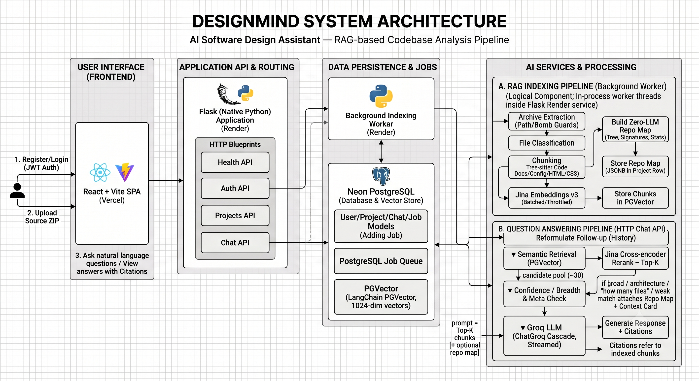

# DesignMind — Architecture Document

## 1. Problem & approach

Build an assistant that answers natural-language questions about an unfamiliar codebase, reasoning
over the project rather than keyword-matching. The challenge lists seven example questions that
span three distinct shapes, and the design serves each differently:

| Question shape | Example questions (from the challenge) | How it's served |
|---|---|---|
| **Local** (specific code) | "How does authentication work?" · "Where is the payment flow?" · "Which APIs create users?" · "How is data stored and retrieved?" | Vector retrieval → cross-encoder rerank → top-K code chunks |
| **Global** (structural) | "Explain the architecture." · "Which files should I modify to add a feature?" · "Summarize the project structure." | Confidence/breadth check attaches the **repo map** (file tree + per-file signatures) |
| **Meta** (aggregate) | "How many files are in this project?" · "What languages are used?" | **Precomputed project stats** in the context card |

The approach is **Retrieval-Augmented Generation (RAG)**: index an uploaded project into searchable
chunks, retrieve the most relevant ones for each question, and have an LLM answer **only from that
retrieved context**, always citing the source files. This grounds answers in the actual code (no
fine-tuning, no hallucinated APIs) and works on any project without retraining.

## 2. System overview



A text summary of the same flow:

```
React (Vite)  ──HTTPS/SSE──►  Flask REST API  ──►  Postgres (Neon) + pgvector
   Vercel                       Render (native            users/projects/chats/jobs
                                Python, no Docker)         + PGVector per-project collections
                                  │  ├─ JWT auth
                                  │  ├─ in-process worker (Postgres-as-queue)
                                  │  └─ retrieval + prompt
                                  ▼
                         Embeddings API (Jina)     LLM cascade (Groq)
```

One set of models everywhere — **Jina embeddings + a 4-model Groq cascade** — identical in dev and
prod. Local and production differ only in environment variables (`DATABASE_URL`, `APP_ENV`,
`FRONTEND_ORIGIN`), never in code, giving full dev/prod parity.

## 3. Major components

**Frontend (React + Vite).** A top bar (brand + profile menu), a sidebar (drag-and-drop upload +
live project status, polled while `INDEXING`), and a streaming chat. Answers render as **Markdown**
with syntax-highlighted, copyable code blocks; the source file(s) appear inline at the end of each
answer. Streaming can be stopped mid-generation. Consumes the SSE stream via `fetch` +
`ReadableStream` (the stream endpoint is an authenticated POST, which `EventSource` can't do).

**API (Flask, app-factory).** Blueprints for auth, projects, and chat. JWT auth; a consistent JSON
error layer (`ApiError`); CORS locked to the frontend origin in prod. Thin routes delegate to a
service layer.

**Persistence (Postgres + pgvector on Neon).** One database holds relational data *and* vectors —
no separate vector service. The app's own tables are `users/projects/chats/jobs`; chunk vectors
live in LangChain PGVector's own per-project collections (`project_<id>`), not in an application
table. Embeddings are **1024-dim (Jina) in both dev and prod**.

**Background indexing (Postgres-as-queue + in-process worker).** Upload returns `202` immediately
after saving the ZIP and enqueuing a `jobs` row. A worker thread claims jobs with
`SELECT … FOR UPDATE SKIP LOCKED`, so N concurrent workers never double-process. Retries are
bounded; a boot-recovery sweep requeues jobs left `RUNNING` by a crash/restart. No Redis/Celery.

**Indexing pipeline.** Safe ZIP extraction (path-traversal + zip-bomb guards) → file classification
(code, docs, config, **stylesheets & markup**; skip vendored, binary, lock, and minified files) →
chunking (Tree-sitter syntax-aware for 10 languages; docs/config/CSS/HTML and any unparseable file
fall back to overlapping line windows, so no file is dropped) → chunks become LangChain `Document`s
added to the project's PGVector collection (batched) → a **repo map** (file tree, per-file
signatures, README/frameworks, and **project stats** — file/function counts, language mix) built
with **zero LLM calls**.

**Retrieval.** PGVector cosine similarity returns a candidate pool, then a **Jina cross-encoder
reranker** (LangChain `JinaRerank`) reorders it and keeps the top-K. A **confidence check** (max
cosine similarity + a breadth/meta heuristic) decides whether to attach the structural context card
— not a brittle keyword router. **Meta/aggregate questions** are routed to the card, whose
precomputed stats + file tree answer questions that vector search fundamentally can't.

**LLM cascade.** LangChain **ChatGroq** drives the Groq cascade: the primary model is built with
`.with_fallbacks([...])`, so LangChain auto-fails-over to the next model on error. Groq limits are
per-model, so the 4-model chain multiplies effective free throughput.

## 4. Request flows

**Upload → index:** `POST /api/projects` saves ZIP → enqueues job → returns 202. Worker: extract →
chunk → embed (batched) → store → build repo map → `READY` (or `FAILED` with reason).

**Ask (per question):** (for a follow-up, first reformulate it into a standalone query using the
recent turns) → embed query → PGVector similarity pool → rerank → confidence/meta check →
(if weak/broad/meta) attach context card / repo map → build a context-constrained prompt → stream
the answer from the cascade → return citations (file, lines, score, snippet) + a "why these
sources" note → persist the turn.

## 5. Explainability (why an answer was produced)

The challenge requires the system to explain *why* it answered. Three mechanisms make every answer
inspectable:

- **Grounded-only generation.** The system prompt forbids using anything outside the retrieved
  context and forbids inventing files/APIs/behaviour; if the context doesn't contain the answer, the
  model must reply *"The information was not found in this project."* This is the core anti-hallucination guardrail.
- **Inline source attribution.** Each answer ends with an `Implemented in <relative/path>` line naming
  the real files the answer drew from.
- **Structured citations.** The API returns, per answer, the **evidence**: each retrieved chunk's
  file path, line range, relevance score, and a snippet, plus a short "why these sources" note (which
  retrieval path fired — local chunks vs. structural card). This lets a user verify the answer against
  the actual code.

## 6. Data model

All relational data is in one Neon Postgres database; chunk vectors are stored separately by
PGVector.

- **users** — `id`, `name`, `email` (unique), `password_hash`, `created_at`.
- **projects** — `id`, `user_id`, `name`, `status` (`UPLOADING|INDEXING|READY|FAILED`), `language`,
  `total_files`, `total_chunks`, `failure_reason`, `context_card` (JSONB), `repo_map` (JSONB),
  `created_at`, `indexed_at`.
- **chats** — `id`, `user_id`, `project_id`, `question`, `answer`, `citations` (JSONB), `created_at`.
- **jobs** — `id`, `project_id`, `type`, `status` (`PENDING|RUNNING|DONE|FAILED`), `attempts`,
  `error`, `payload` (JSONB), timestamps. Indexed on `(status, created_at)` — this table *is* the queue.
- **Chunk vectors** — LangChain PGVector's own tables, one **collection per project** (`project_<id>`):
  page content + embedding + metadata (`file_path`, `chunk_type`, `symbol_name`, `start_line`, `end_line`, `language`).

Deleting a project cascades its chats/jobs (foreign keys); its PGVector collection is dropped explicitly.

## 7. Key design decisions & trade-offs

| Decision | Why | Trade-off |
|---|---|---|
| RAG (not fine-tuning) | Grounded, citable, works on any repo, free | Answer quality bounded by retrieval quality |
| LangChain for the RAG pipeline | Industry-standard, composable, less bespoke code (PGVector/ChatGroq/JinaRerank/LCEL) | Heavier deps / version churn |
| Cross-encoder reranker for result ordering | Reorders the vector candidate pool by true query relevance, which the top-K depends on | An extra rerank API call per question |
| pgvector in Postgres | Free, persistent, one fewer service | Not a specialized vector DB (fine at this scale) |
| Postgres-as-queue (not Celery/Redis) | Durable async on one free box, no extra service | Polling latency; not a full broker |
| Confidence-based context (not keyword routing) | Robust to any phrasing | A tuned threshold, not a learned classifier |
| Precomputed project facts in the card | Answers count/list/language questions vector search can't | Stats recomputed only on (re-)index |
| History-aware query reformulation | Follow-ups resolve without polluting retrieval | One extra cheap LLM call per follow-up |
| Jina embeddings (dev == prod) | Removes PyTorch → runs on a free non-Docker host; full parity | Network hop + embedding-API rate limits |
| Render native Python (not Docker/HF) | Simplest free deploy, no container to maintain | Free tier sleeps (cold starts) |
| Same models dev == prod | One code path, full parity, no "works locally, breaks in prod" | Dev needs the API keys; shares Groq's per-account quota |
| Zero-LLM repo map | Global-question context without burning rate limits | Signatures, not deep semantic summaries |

## 8. Failure handling

Corrupt/empty/oversized/path-traversal ZIPs fail fast (`PermanentJobError`, no wasted retries);
transient errors retry with backoff; jobs surviving a crash are recovered on boot; unsupported files
fall back to window chunking; "no relevant chunks" and the system-prompt guardrail prevent fabricated
answers; the LLM cascade fails over on rate limits; every API error returns a consistent JSON shape.

## 9. Security

- **Auth:** JWT (bearer tokens); passwords stored only as pbkdf2:sha256 hashes; login uses one
  identical error for unknown-email vs. wrong-password (no user enumeration).
- **Project isolation:** every read/delete checks ownership (`user_id`) and returns 404 otherwise;
  each project's vectors live in a separate PGVector collection.
- **Upload safety:** path-traversal and zip-bomb guards; size / entry / file caps.
- **Secrets:** provided only via environment variables / host dashboards, never committed; CORS
  locked to the frontend origin in production.

## 10. Scale considerations

Async indexing keeps uploads instant; embeddings + inserts are streamed in batches to bound memory;
`WORKER_CONCURRENCY` parallelizes indexing (safe via SKIP LOCKED); each project's vectors live in
their own PGVector collection, so every search scans only that project's chunks; a single shared,
pre-pinged connection pool serves all collections. Horizontal scale-out (multiple worker processes /
a managed queue) is a config/infra change, not a rewrite.

## 11. Testing & evaluation

- **Unit tests** (`pytest`) cover the risk areas: chunking, safe extraction, file classification,
  embedding batching, retrieval merge/rerank fallback, conversation memory, `<think>`-stripping, and
  API auth/error paths.
- **RAG evaluation.** On a real MERN + Prisma project, a labelled question set was run end-to-end
  through the live pipeline. Retrieval reached a **100% hit-rate** (the correct file was in the top-K
  for every labelled query), answers were **faithful** to the source (zero fabricated files/APIs),
  and out-of-scope questions ("how does billing work?") were **correctly refused**. Follow-up
  questions ("where is it used?", "no, I meant registration") resolved to the right files.

## 12. Challenges encountered

- **Free-tier without Docker:** local embedding models forced a heavy host; solved by offloading
  embeddings to an API so the backend runs as plain Python.
- **Global vs. local questions:** pure top-K under-serves architecture/meta questions; solved with a
  confidence-gated repo map + precomputed stats, built without LLM calls (rate-limit safe).
- **Per-model rate limits:** solved with a model cascade — `ChatGroq(...).with_fallbacks([...])`
  advances to the next model on error, keyed on the per-model quota structure.
- **Serverless-Postgres connections:** Neon closes idle connections; a single shared, pre-pinged
  connection pool (reused across all PGVector collections) keeps retrieval robust instead of building
  a new pool per query.

## 13. What I'd improve with more time

Incremental re-indexing and GitHub import; an optional lexical retriever combined with the vector
search via LangChain's `EnsembleRetriever`; cross-project search; per-user quotas / rate-limiting;
surfacing indexing truncation in the UI; and moving indexing to a dedicated worker service for true
horizontal scale.
